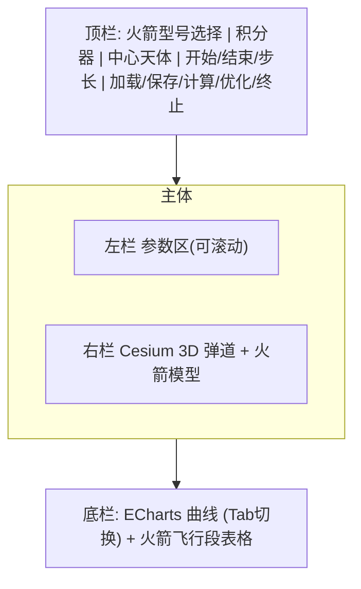

# RocketSim3D UI 设计

## 目标

基于 [README.md](README.md) 与参考图 `DDJS/rocket.png`，构建一个三区布局的弹道仿真桌面级 Web 界面：左侧参数输入区、右侧 3D 弹道（Cesium）、底部曲线（ECharts）+ 飞行段表格。支持选择 3 个火箭（CZ-2D / CZ-4B / CZ-4C），加载 DDJS 中对应 json，调用真实 webapi 计算/优化，并可视化结果。

## 技术选型

- **框架**: React + Vite（JS/JSX）
- **曲线**: ECharts（轻封装，不依赖 echarts-for-react）
- **3D**: CesiumJS（`cesium` + `vite-plugin-cesium`），加载 gltf/glb 火箭模型，绘制三维弹道
- **依赖**: `echarts`、`cesium`、`vite-plugin-cesium`
- **脚手架**: `package.json`、`index.html`、`vite.config.js`、`src/` 入口

## 整体布局（还原 rocket.png 暗色工程风）



### 参数区分组（GroupBox 卡片式）

- **基本参数**: 发射点（Name_FaSheDian）、经纬度高度（FaSheDianLLA）、整流罩质量、有效载荷 Gw、Sm、Alpham、T1 等
- **初始参数 / 入轨参数**: A0、目标轨道 sma0（km↔m 换算显示）、ecc0、inc0、omg0、轨道类型
- **飞行时序**: 单独 GroupBox（Tk_1、Tk_F、Tk_2z、Tk_2u、Dt_k12f、Tk_3、Dt_k23f、Dt_msxz、Dt_xjfl 等，按型号字段动态显示）
- **各级参数**: 一级 / 二级 / 三级 分别成组，每组含总质量、推进剂质量、发动机子卡片（推力 Force、比冲 Ips、台数、喷口面积 Sa、安装偏角、真空标记）
- **优化配置（Profiles）**: Controls（自变量上下界/Scale）与 Results（目标/约束）表格

## 数据与 API

- `src/data/rockets.js`: 三个火箭元数据（型号、对应 DDJS json 路径、glb 模型路径），DDJS json 作为默认输入加载到表单
- `src/api/trajectory.js`: `POST /Rocket/TrajectoryOptim`，请求体 `{ RocketInput, Profiles, RunProfiles, GetAllData:true, GetKeyData:true }`
- **跨域**: 在 `vite.config.js` 配置 proxy，将 `/api` 代理到 `http://astrox.cn:8764`
- **响应字段**: `DicShiXu` / `DicKeyData` / `DicAllData` / `DicZJLD`
- **曲线（默认）**: 时间-动压、时间-高度&速度（双 Y 轴）、时间-轴向过载、时间-质量、时间-推力

### API 字段映射（已联调）

| 用途 | 字段 |
| --- | --- |
| 时间 | `tt` |
| 动压 | `q` |
| 高度 | `h` |
| 速度 | `V` |
| 轴向过载 | `nx` |
| 质量 | `mass` |
| 推力 | `Fx` |
| 经度 | `Lambda` |
| 纬度 | `d_B` |

## 文件结构

```
index.html
package.json
vite.config.js
public/models/          # GLB 火箭模型
  CZ-2D.glb
  CZ-4B.glb
  CZ-4C.glb
src/
  main.jsx
  App.jsx
  styles/
    theme.css           # 暗色工程主题变量
    app.css
  components/
    TopBar.jsx
    ParamPanel.jsx
    Cesium3D.jsx
    StageTable.jsx
    params/
      GroupBox.jsx
      Field.jsx
      BasicParams.jsx
      OrbitParams.jsx
      Timeline.jsx
      StageGroup.jsx
      EngineCard.jsx
      OptimProfile.jsx
    charts/
      TrajectoryCharts.jsx
  api/
    trajectory.js
  data/
    rockets.js
  utils/
    adapt.js
    rocketSchema.js
```

## 视觉风格

参考 `DDJS/rocket.png`：

- 深色背景，橙色 GroupBox 标题
- 浅蓝/灰色按钮
- 表格交替行色，计算结果列用红色
- 单位显示在输入框右侧（deg、km、s、kg 等）

## 实施顺序

1. 脚手架 + 主题 + 布局骨架
2. 参数表单（用 DDJS json 驱动）
3. 接入 API 与曲线/表格
4. Cesium 3D 弹道与 glb 模型

## 待确认 / 风险

- glb 火箭模型需放在 `public/models/`，文件名与 `rockets.js` 中 `modelPath` 一致
- 外网 API 的 CORS / 可用性，通过 Vite proxy 规避浏览器跨域
- 无 Cesium Ion Token 时使用 OpenStreetMap 底图；设置 `VITE_CESIUM_ION_TOKEN` 可启用 World Terrain

## 启动

```bash
npm install
npm run dev
```

浏览器访问 `http://localhost:5173`，选择火箭方案 → 编辑参数 → 点击「计算」或「优化」→ 查看曲线、飞行段表格与三维弹道。
